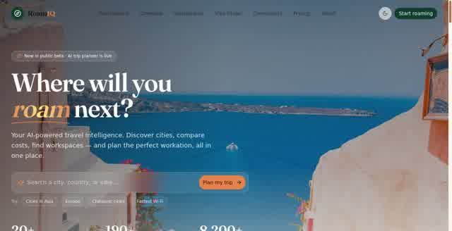

# RoamIQ

[](https://nomads-travel-indol.vercel.app/)
[](https://github.com/pranavgawasproject/RoamIQ/stargazers)
[](LICENSE)

> A practical operating system for digital nomads: compare destinations, understand visa options, estimate real costs, and find places that make remote work easier.

**[Open the live demo →](https://nomads-travel-indol.vercel.app/)**

## Overview

RoamIQ brings the decisions behind a good move abroad into one focused experience. Explore destinations through cost-of-living and connectivity signals, research digital-nomad visa pathways, compare cities, and discover coworking and remote-work possibilities before you book the flight.

The current product experience is the redesigned Next.js app in `frontend/`. It uses an editorial, travel-first interface so research feels quick on a phone or laptop—not like a spreadsheet of disconnected tabs.

## Screenshots / Demo

### Homepage



### Destination directory


Try the full experience at **[nomads-travel-indol.vercel.app](https://nomads-travel-indol.vercel.app/)**.

## Features

- **Destination intelligence** — browse cities with cost, rent, Wi-Fi, safety, and other practical signals.
- **Visa research** — use the product as a starting point for comparing digital-nomad visa requirements and eligibility considerations.
- **Cost comparison** — break down everyday expenses and compare possible home bases.
- **Coworking and remote-work discovery** — keep workability, not just scenery, in the decision.
- **Workation planning** — organize multi-city ideas, budgets, and tax-residency considerations.
- **Responsive experience** — a warm, editorial UI with accessible controls, dark-mode support, and mobile navigation.

## Tech stack

- **Framework:** Next.js 16 App Router and React 19
- **Language:** TypeScript
- **Styling:** Tailwind CSS 4 and custom design tokens
- **UI:** shadcn/ui-style primitives built on Radix UI
- **Interaction:** Framer Motion, React Hook Form, Recharts, and Lucide icons
- **Data/auth integration:** Supabase client libraries and existing project services
- **Deployment:** Vercel

## Setup

The active app lives in `frontend/`:

```bash
cd RoamIQ/frontend
```

Open http://localhost:3000. For production, use the package scripts to build and start the app. From the repository root, the build script delegates to the same frontend build.

## Environment variables

Create `frontend/.env.local` when using Supabase-backed flows:

| Variable | Purpose |
| --- | --- |
| `NEXT_PUBLIC_SUPABASE_URL` | Supabase project URL exposed to the browser client |
| `NEXT_PUBLIC_SUPABASE_ANON_KEY` | Supabase anonymous key |
| `ADMIN_PASSWORD` | Server-only password for the admin route; never prefix it with `NEXT_PUBLIC_` |
| `VITE_SUPABASE_URL` | Optional compatibility fallback for legacy/server-side environments |
| `VITE_SUPABASE_ANON_KEY` | Optional compatibility fallback for legacy/server-side environments |

Start from [`frontend/.env.example`](frontend/.env.example). Never commit real keys or passwords.

## Deploy

Deploy the `frontend/` directory to Vercel. Set the project root directory to `frontend`, use the project build script, and add the variables above in the Vercel project settings. Vercel detects the Next.js output automatically.

## Contributing

Issues, focused improvements, and product ideas are welcome. Please open an issue before substantial changes, keep pull requests scoped, and run the linter, tests, and production build from `frontend/` before submitting.

## License

MIT. See [LICENSE](LICENSE).
